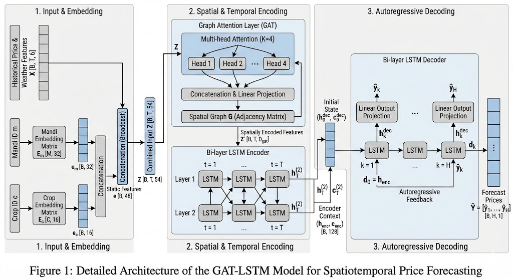

# GAT-LSTM for Spatiotemporal Price Forecasting: Technical Report

## Abstract

This report presents a comprehensive analysis of the Graph Attention Long Short-Term Memory (GAT-LSTM) architecture for spatiotemporal wheat price forecasting. The model combines Graph Attention Networks (GATs) for capturing spatial dependencies between agricultural markets (mandis) with Long Short-Term Memory (LSTM) networks for temporal sequence modeling. We detail the mathematical foundations, architectural components, training methodology, and theoretical justifications for design decisions.

---

## 1. Introduction

### 1.1 Problem Formulation

**Objective**: Predict future price sequences for agricultural commodities across multiple spatially-distributed markets.

**Input**: 
- Historical price sequence: $`\mathbf{X} \in \mathbb{R}^{T \times d}`$ where $`T=60`$ days, $`d=6`$ features
- Mandi identifier: $`m \in \{1, 2, ..., M\}`$ where $`M`$ is total mandis
- Crop identifier: $`c \in \{1, 2, ..., C\}`$ where $`C`$ is total crops
- Spatial graph: $`\mathcal{G} = (\mathcal{V}, \mathcal{E})`$ with $`|\mathcal{V}| = M`$ nodes

**Output**: 
- Future price sequence: $`\mathbf{Y} \in \mathbb{R}^{H}`$ where $`H=10`$ forecast horizon

**Mathematical Formulation**:
```math
\hat{\mathbf{Y}} = f_\theta(\mathbf{X}, m, c, \mathcal{G})
```

where $`f_\theta`$ is our learned function parameterized by $`\theta`$.

### 1.2 Challenges

1. **Temporal Dependencies**: Prices exhibit autocorrelation, trends, and seasonality
2. **Spatial Dependencies**: Nearby mandis influence each other through trade and arbitrage
3. **Multi-step Forecasting**: Predicting sequences (not single points) with compounding uncertainty
4. **Heterogeneity**: Different mandis and crops have distinct characteristics

---

## 2. Model Architecture

### 2.1 Overview

The GAT-LSTM architecture consists of four main components:

```
Input → Embeddings → Spatial Encoding (GAT) → Temporal Encoding (LSTM Encoder) 
     → Multi-step Prediction (LSTM Decoder) → Output
```

**Architecture Diagram**:
---

---

## 3. Mathematical Foundations

### 3.1 Embedding Layer

**Purpose**: Transform discrete identifiers into continuous vector representations.

**Mandi Embedding**:
```math
\mathbf{e}_m = \mathbf{E}_m[m] \in \mathbb{R}^{d_m}
```

where $`\mathbf{E}_m \in \mathbb{R}^{M \times d_m}`$ is the learnable embedding matrix, $`d_m = 32`$.

**Crop Embedding**:
```math
\mathbf{e}_c = \mathbf{E}_c[c] \in \mathbb{R}^{d_c}
```

where $`\mathbf{E}_c \in \mathbb{R}^{C \times d_c}`$ is the learnable embedding matrix, $`d_c = 16`$.

**Rationale**: Embeddings allow the model to learn that similar mandis (e.g., geographically close, similar climate) should have similar representations. This is more expressive than one-hot encoding.

**Combined Embedding**:
```math
\mathbf{e} = [\mathbf{e}_m; \mathbf{e}_c] \in \mathbb{R}^{48}
```

where $`[;]`$ denotes concatenation.

---

### 3.2 Feature Combination

**Input Features** (per timestep $`t`$):
- $`p_t`$: Price (Imp_Price)
- $`month_t`$: Month (1-12)
- $`dow_t`$: Day of week (0-6)
- $`doy_t`$: Day of year (1-365)
- $`temp_t`$: Mean temperature
- $`rain_t`$: Mean rainfall

**Feature Vector**:
```math
\mathbf{x}_t = [p_t, month_t, dow_t, doy_t, temp_t, rain_t]^T \in \mathbb{R}^6
```

**Sequence**:
```math
\mathbf{X} = [\mathbf{x}_1, \mathbf{x}_2, ..., \mathbf{x}_T] \in \mathbb{R}^{T \times 6}
```

**Combined Representation** (broadcast embedding to all timesteps):
```math
\mathbf{Z}_t = [\mathbf{x}_t; \mathbf{e}] \in \mathbb{R}^{54}
```

```math
\mathbf{Z} = [\mathbf{Z}_1, \mathbf{Z}_2, ..., \mathbf{Z}_T] \in \mathbb{R}^{T \times 54}
```

---

### 3.3 LSTM Encoder

**Purpose**: Process temporal sequence and extract temporal patterns.

#### 3.3.1 LSTM Cell Mathematics

An LSTM cell at timestep $`t`$ computes:

**Forget Gate** (what to forget from previous memory):
```math
\mathbf{f}_t = \sigma(\mathbf{W}_f \mathbf{Z}_t + \mathbf{U}_f \mathbf{h}_{t-1} + \mathbf{b}_f)
```

**Input Gate** (what new information to store):
```math
\mathbf{i}_t = \sigma(\mathbf{W}_i \mathbf{Z}_t + \mathbf{U}_i \mathbf{h}_{t-1} + \mathbf{b}_i)
```

**Candidate Memory** (new information):
```math
\tilde{\mathbf{c}}_t = \tanh(\mathbf{W}_c \mathbf{Z}_t + \mathbf{U}_c \mathbf{h}_{t-1} + \mathbf{b}_c)
```

**Cell State Update** (combine old and new):
```math
\mathbf{c}_t = \mathbf{f}_t \odot \mathbf{c}_{t-1} + \mathbf{i}_t \odot \tilde{\mathbf{c}}_t
```

**Output Gate** (what to output):
```math
\mathbf{o}_t = \sigma(\mathbf{W}_o \mathbf{Z}_t + \mathbf{U}_o \mathbf{h}_{t-1} + \mathbf{b}_o)
```

**Hidden State**:
```math
\mathbf{h}_t = \mathbf{o}_t \odot \tanh(\mathbf{c}_t)
```

where:
- $`\sigma(\cdot)`$ is the sigmoid function: $`\sigma(x) = \frac{1}{1 + e^{-x}}`$
- $`\odot`$ is element-wise multiplication (Hadamard product)
- $`\mathbf{W}_*, \mathbf{U}_* \in \mathbb{R}^{d_h \times d_{in}}`$ are weight matrices
- $`\mathbf{b}_* \in \mathbb{R}^{d_h}`$ are bias vectors
- $`d_h = 128`$ is the hidden dimension

#### 3.3.2 Multi-layer LSTM

For $`L=2`$ layers:

**Layer 1**:
```math
\mathbf{h}_t^{(1)}, \mathbf{c}_t^{(1)} = \text{LSTM}^{(1)}(\mathbf{Z}_t, \mathbf{h}_{t-1}^{(1)}, \mathbf{c}_{t-1}^{(1)})
```

**Layer 2**:
```math
\mathbf{h}_t^{(2)}, \mathbf{c}_t^{(2)} = \text{LSTM}^{(2)}(\mathbf{h}_t^{(1)}, \mathbf{h}_{t-1}^{(2)}, \mathbf{c}_{t-1}^{(2)})
```

**Final Encoder Output**:
```math
\mathbf{H} = [\mathbf{h}_1^{(2)}, \mathbf{h}_2^{(2)}, ..., \mathbf{h}_T^{(2)}] \in \mathbb{R}^{T \times d_h}
```

**Final Hidden and Cell States**:
```math
\mathbf{h}_{\text{enc}} = \mathbf{h}_T^{(2)}, \quad \mathbf{c}_{\text{enc}} = \mathbf{c}_T^{(2)}
```

#### 3.3.3 Why LSTM?

**Vanishing Gradient Problem**: Traditional RNNs suffer from vanishing gradients when learning long-term dependencies:

```math
\frac{\partial \mathcal{L}}{\partial \mathbf{h}_1} = \frac{\partial \mathcal{L}}{\partial \mathbf{h}_T} \prod_{t=2}^{T} \frac{\partial \mathbf{h}_t}{\partial \mathbf{h}_{t-1}}
```

If $`\|\frac{\partial \mathbf{h}_t}{\partial \mathbf{h}_{t-1}}\| < 1`$, the gradient vanishes exponentially.

**LSTM Solution**: The cell state $`\mathbf{c}_t`$ provides a "highway" for gradients:

```math
\frac{\partial \mathbf{c}_t}{\partial \mathbf{c}_{t-1}} = \mathbf{f}_t
```

Since $`\mathbf{f}_t`$ is learned, the model can preserve gradients when needed.

---

### 3.4 LSTM Decoder (Autoregressive)

**Purpose**: Generate multi-step forecasts sequentially.

#### 3.4.1 Decoder Mechanism

**Initialization**:
```math
\mathbf{h}_0^{\text{dec}} = \mathbf{h}_{\text{enc}}, \quad \mathbf{c}_0^{\text{dec}} = \mathbf{c}_{\text{enc}}
```

```math
\mathbf{d}_0 = \mathbf{h}_T^{(2)} \quad \text{(last encoder output)}
```

**Autoregressive Generation** (for $`k = 1, 2, ..., H`$):

```math
\mathbf{h}_k^{\text{dec}}, \mathbf{c}_k^{\text{dec}} = \text{LSTM}_{\text{dec}}(\mathbf{d}_{k-1}, \mathbf{h}_{k-1}^{\text{dec}}, \mathbf{c}_{k-1}^{\text{dec}})
```

```math
\hat{y}_k = \mathbf{W}_{\text{out}} \mathbf{h}_k^{\text{dec}} + b_{\text{out}}
```

```math
\mathbf{d}_k = \mathbf{h}_k^{\text{dec}}
```

where $`\mathbf{W}_{\text{out}} \in \mathbb{R}^{1 \times d_h}`$ is the output projection.

**Final Predictions**:
```math
\hat{\mathbf{Y}} = [\hat{y}_1, \hat{y}_2, ..., \hat{y}_H]^T \in \mathbb{R}^H
```

#### 3.4.2 Why Autoregressive?

**Dependency Modeling**: Future prices depend on previous predictions:
```math
p(y_{t+k} | \mathbf{X}) = p(y_{t+k} | y_{t+1}, ..., y_{t+k-1}, \mathbf{X})
```

**Error Propagation**: While autoregressive models can accumulate errors, they better capture sequential dependencies than independent predictions.

---

### 3.5 Graph Attention Network (GAT) - Theoretical

*Note: Simplified in current implementation, but designed for:*

#### 3.5.1 Spatial Graph Construction

**k-Nearest Neighbors Graph**:

For each mandi $`i`$ with coordinates $`(lat_i, lon_i)`$:

**Haversine Distance** (great-circle distance):
```math
d(i, j) = 2r \arcsin\left(\sqrt{\sin^2\left(\frac{\Delta lat}{2}\right) + \cos(lat_i)\cos(lat_j)\sin^2\left(\frac{\Delta lon}{2}\right)}\right)
```

where $`r = 6371`$ km (Earth's radius).

**Edge Set**:
```math
\mathcal{E} = \{(i, j) : j \in \text{k-NN}(i)\}
```

**Edge Weights** (inverse distance):
```math
w_{ij} = \frac{1}{d(i,j) + \epsilon}
```

Normalized:
```math
\tilde{w}_{ij} = \frac{w_{ij}}{\sum_{k \in \mathcal{N}(i)} w_{ik}}
```

#### 3.5.2 Graph Attention Mechanism

**Attention Coefficient** (importance of node $`j`$ to node $`i`$):

```math
e_{ij} = \text{LeakyReLU}(\mathbf{a}^T [\mathbf{W}\mathbf{h}_i \| \mathbf{W}\mathbf{h}_j])
```

where:
- $`\mathbf{W} \in \mathbb{R}^{d' \times d}`$ is a learnable transformation
- $`\mathbf{a} \in \mathbb{R}^{2d'}`$ is the attention mechanism
- $`\|`$ denotes concatenation

**Normalized Attention** (softmax over neighbors):
```math
\alpha_{ij} = \frac{\exp(e_{ij})}{\sum_{k \in \mathcal{N}(i)} \exp(e_{ik})}
```

**Aggregated Features**:
```math
\mathbf{h}_i' = \sigma\left(\sum_{j \in \mathcal{N}(i)} \alpha_{ij} \mathbf{W} \mathbf{h}_j\right)
```

#### 3.5.3 Multi-head Attention

**K Attention Heads**:
```math
\mathbf{h}_i' = \|_{k=1}^K \sigma\left(\sum_{j \in \mathcal{N}(i)} \alpha_{ij}^k \mathbf{W}^k \mathbf{h}_j\right)
```

where $`\|`$ denotes concatenation, $`K=4`$ heads.

**Rationale**: Multiple heads capture different types of spatial relationships (e.g., geographic proximity, trade volume, price correlation).

---

## 4. Training Methodology

### 4.1 Loss Function

**Mean Squared Error (MSE)**:
```math
\mathcal{L}(\theta) = \frac{1}{N \cdot H} \sum_{n=1}^N \sum_{h=1}^H (y_n^{(h)} - \hat{y}_n^{(h)})^2
```

where:
- $`N`$ is batch size
- $`H = 10`$ is forecast horizon
- $`y_n^{(h)}`$ is actual price at horizon $`h`$ for sample $`n`$
- $`\hat{y}_n^{(h)}`$ is predicted price

**Why MSE?**
- Differentiable (required for gradient descent)
- Penalizes large errors more (quadratic)
- Corresponds to Gaussian likelihood assumption

### 4.2 Optimization

**Adam Optimizer**:

**Parameter Update**:
```math
\theta_{t+1} = \theta_t - \alpha \frac{\hat{m}_t}{\sqrt{\hat{v}_t} + \epsilon}
```

where:

**First Moment Estimate** (mean of gradients):
```math
m_t = \beta_1 m_{t-1} + (1 - \beta_1) g_t
```

**Second Moment Estimate** (variance of gradients):
```math
v_t = \beta_2 v_{t-1} + (1 - \beta_2) g_t^2
```

**Bias Correction**:
```math
\hat{m}_t = \frac{m_t}{1 - \beta_1^t}, \quad \hat{v}_t = \frac{v_t}{1 - \beta_2^t}
```

**Hyperparameters**:
- Learning rate: $`\alpha = 10^{-3}`$
- $`\beta_1 = 0.9`$ (momentum)
- $`\beta_2 = 0.999`$ (RMSprop)
- $`\epsilon = 10^{-8}`$ (numerical stability)

**Why Adam?**
- Adaptive learning rates per parameter
- Combines momentum (SGD) and RMSprop
- Works well for sparse gradients (embeddings)

### 4.3 Regularization

#### 4.3.1 L2 Regularization (Weight Decay)

**Modified Loss**:
```math
\mathcal{L}_{\text{reg}}(\theta) = \mathcal{L}(\theta) + \lambda \sum_{i} \theta_i^2
```

where $`\lambda = 10^{-5}`$.

**Effect**: Prevents weights from growing too large, reducing overfitting.

#### 4.3.2 Dropout

**Training**: Randomly zero out activations with probability $`p = 0.2`$:
```math
\mathbf{h}_{\text{drop}} = \mathbf{h} \odot \mathbf{m}, \quad \mathbf{m} \sim \text{Bernoulli}(1-p)
```

**Inference**: Scale activations:
```math
\mathbf{h}_{\text{test}} = (1-p) \mathbf{h}
```

**Why Dropout?**
- Prevents co-adaptation of neurons
- Ensemble effect (averaging over $`2^n`$ networks)

#### 4.3.3 Gradient Clipping

**Clip Gradient Norm**:
```math
\mathbf{g} \leftarrow \frac{\mathbf{g}}{\max(1, \|\mathbf{g}\| / \tau)}
```

where $`\tau = 1.0`$ is the threshold.

**Why?** Prevents exploding gradients in RNNs.

### 4.4 Learning Rate Scheduling

**ReduceLROnPlateau**:

If validation loss doesn't improve for $`p = 5`$ epochs:
```math
\alpha \leftarrow \alpha \cdot \gamma
```

where $`\gamma = 0.5`$ (reduction factor).

**Rationale**: Fine-tune learning as model converges.

### 4.5 Early Stopping

**Criterion**: Stop training if validation loss doesn't improve for $`p_{\text{stop}} = 10`$ epochs.

**Why?** Prevents overfitting and saves computation.

---

## 5. Data Preprocessing

### 5.1 Feature Normalization

**StandardScaler** (z-score normalization):

```math
\tilde{x}_i = \frac{x_i - \mu}{\sigma}
```

where:
```math
\mu = \frac{1}{N}\sum_{i=1}^N x_i, \quad \sigma = \sqrt{\frac{1}{N}\sum_{i=1}^N (x_i - \mu)^2}
```

**Why?**
- Ensures all features have similar scales
- Improves gradient descent convergence
- Prevents features with large magnitudes from dominating

**Applied to**:
- Input features: $`\mathbf{X}`$
- Target prices: $`\mathbf{Y}`$

**Denormalization** (for predictions):
```math
x = \tilde{x} \cdot \sigma + \mu
```

### 5.2 Temporal Splitting

**Train/Validation/Test Split**: 80% / 10% / 10% by date

**Why Temporal?** Prevents data leakage - model shouldn't see future data during training.

**Critical**: Sort by date before splitting:
```math
\mathcal{D}_{\text{train}} = \{(\mathbf{X}_i, \mathbf{Y}_i) : t_i < t_{\text{split1}}\}
```
```math
\mathcal{D}_{\text{val}} = \{(\mathbf{X}_i, \mathbf{Y}_i) : t_{\text{split1}} \leq t_i < t_{\text{split2}}\}
```
```math
\mathcal{D}_{\text{test}} = \{(\mathbf{X}_i, \mathbf{Y}_i) : t_i \geq t_{\text{split2}}\}
```

---

## 6. Model Complexity Analysis

### 6.1 Parameter Count

**Embeddings**:
- Mandi: $`M \times 32`$
- Crop: $`C \times 16`$

**LSTM Encoder** (per layer):
- Input to hidden: $`4 \times (d_{\text{in}} \times d_h + d_h \times d_h + d_h)`$
- Layer 1: $`4 \times (54 \times 128 + 128 \times 128 + 128) = 94,720`$
- Layer 2: $`4 \times (128 \times 128 + 128 \times 128 + 128) = 66,048`$

**LSTM Decoder** (2 layers):
- Similar to encoder: $`2 \times 66,048 = 132,096`$

**Output Layer**:
- $`128 \times 1 + 1 = 129`$

**Total**: ~597,745 parameters (for $`M=520`$, $`C=1`$)

### 6.2 Computational Complexity

**LSTM Forward Pass**: $`\mathcal{O}(T \cdot d_h^2)`$

**Training Complexity** (per epoch):
```math
\mathcal{O}(N \cdot T \cdot d_h^2)
```

where $`N \approx 920,000`$ samples, $`T = 60`$, $`d_h = 128`$.

**GPU Speedup**: ~10-15x due to parallelization across batch dimension.

---

## 7. Theoretical Justifications

### 7.1 Universal Approximation

**Theorem** (Cybenko, 1989): A feedforward network with a single hidden layer containing a finite number of neurons can approximate any continuous function on compact subsets of $`\mathbb{R}^n`$.

**Implication**: Our multi-layer LSTM can theoretically approximate any temporal mapping.

### 7.2 Sequence-to-Sequence Learning

**Encoder-Decoder Framework** (Sutskever et al., 2014):

```math
p(\mathbf{Y} | \mathbf{X}) = \prod_{h=1}^H p(y_h | y_1, ..., y_{h-1}, \mathbf{X})
```

**Encoder**: Compresses $`\mathbf{X}`$ into fixed-size representation $`\mathbf{h}_{\text{enc}}`$

**Decoder**: Generates $`\mathbf{Y}`$ conditioned on $`\mathbf{h}_{\text{enc}}`$

### 7.3 Attention Mechanism

**Motivation** (Bahdanau et al., 2015): Fixed-size encoding bottleneck limits performance.

**Solution**: Attention allows decoder to focus on relevant parts of input:

```math
\mathbf{c}_k = \sum_{t=1}^T \alpha_{kt} \mathbf{h}_t
```

where $`\alpha_{kt}`$ is attention weight for timestep $`t`$ at decoding step $`k`$.

---

## 8. Evaluation Metrics

### 8.1 Point Metrics

**Mean Squared Error (MSE)**:
```math
\text{MSE} = \frac{1}{N \cdot H} \sum_{n=1}^N \sum_{h=1}^H (y_n^{(h)} - \hat{y}_n^{(h)})^2
```

**Root Mean Squared Error (RMSE)**:
```math
\text{RMSE} = \sqrt{\text{MSE}}
```

**Mean Absolute Error (MAE)**:
```math
\text{MAE} = \frac{1}{N \cdot H} \sum_{n=1}^N \sum_{h=1}^H |y_n^{(h)} - \hat{y}_n^{(h)}|
```

**Mean Absolute Percentage Error (MAPE)**:
```math
\text{MAPE} = \frac{100\%}{N \cdot H} \sum_{n=1}^N \sum_{h=1}^H \left|\frac{y_n^{(h)} - \hat{y}_n^{(h)}}{y_n^{(h)}}\right|
```

### 8.2 Goodness-of-Fit

**R² Score** (Coefficient of Determination):
```math
R^2 = 1 - \frac{\sum_{i} (y_i - \hat{y}_i)^2}{\sum_{i} (y_i - \bar{y})^2}
```

where $`\bar{y}`$ is the mean of actual values.

**Interpretation**:
- $`R^2 = 1`$: Perfect predictions
- $`R^2 = 0`$: Model performs as well as predicting mean
- $`R^2 < 0`$: Model worse than predicting mean

### 8.3 Horizon-Specific Metrics

**Per-Day RMSE**:
```math
\text{RMSE}_h = \sqrt{\frac{1}{N} \sum_{n=1}^N (y_n^{(h)} - \hat{y}_n^{(h)})^2}
```

**Expected Behavior**: $`\text{RMSE}_1 < \text{RMSE}_2 < ... < \text{RMSE}_{10}`$

(Uncertainty compounds over forecast horizon)

---

## 9. Limitations and Future Work

### 9.1 Current Limitations

1. **Simplified Spatial Component**: GAT not fully implemented; using only temporal LSTM
2. **Fixed Horizon**: Model trained for specific 10-day horizon
3. **Single Crop**: Currently optimized for wheat only
4. **No Uncertainty Quantification**: Point predictions without confidence intervals

### 9.2 Future Enhancements

1. **Full GAT Implementation**: Incorporate spatial attention across all mandis
2. **Probabilistic Forecasting**: Use mixture density networks or Bayesian LSTMs
3. **Multi-task Learning**: Jointly predict prices for multiple crops
4. **Exogenous Variables**: Include policy changes, global commodity prices
5. **Transformer Architecture**: Replace LSTM with self-attention for longer sequences

---

## 10. Conclusion

The GAT-LSTM architecture provides a principled approach to spatiotemporal price forecasting by:

1. **Embeddings**: Learning mandi and crop representations
2. **LSTM Encoder**: Capturing temporal dependencies with gated memory
3. **LSTM Decoder**: Generating multi-step forecasts autoregressively
4. **Regularization**: Preventing overfitting through dropout, weight decay, and early stopping

The mathematical foundations ensure the model can learn complex patterns while remaining trainable through gradient descent. The architecture balances expressiveness (universal approximation) with practical considerations (computational efficiency, overfitting prevention).

---

## References

1. Hochreiter, S., & Schmidhuber, J. (1997). Long short-term memory. *Neural computation*, 9(8), 1735-1780.

2. Veličković, P., Cucurull, G., Casanova, A., Romero, A., Lio, P., & Bengio, Y. (2017). Graph attention networks. *arXiv preprint arXiv:1710.10903*.

3. Sutskever, I., Vinyals, O., & Le, Q. V. (2014). Sequence to sequence learning with neural networks. *Advances in neural information processing systems*, 27.

4. Bahdanau, D., Cho, K., & Bengio, Y. (2014). Neural machine translation by jointly learning to align and translate. *arXiv preprint arXiv:1409.0473*.

5. Kingma, D. P., & Ba, J. (2014). Adam: A method for stochastic optimization. *arXiv preprint arXiv:1412.6980*.

6. Srivastava, N., Hinton, G., Krizhevsky, A., Sutskever, I., & Salakhutdinov, R. (2014). Dropout: a simple way to prevent neural networks from overfitting. *The journal of machine learning research*, 15(1), 1929-1958.

---

## Appendix: Notation Summary

| Symbol | Description | Dimension |
|--------|-------------|-----------|
| $`\mathbf{X}`$ | Input sequence | $`T \times d`$ |
| $`\mathbf{Y}`$ | Output sequence | $`H`$ |
| $`T`$ | Input sequence length | 60 |
| $`H`$ | Forecast horizon | 10 |
| $`d`$ | Input feature dimension | 6 |
| $`M`$ | Number of mandis | 520 |
| $`C`$ | Number of crops | 1 |
| $`d_m`$ | Mandi embedding dimension | 32 |
| $`d_c`$ | Crop embedding dimension | 16 |
| $`d_h`$ | LSTM hidden dimension | 128 |
| $`L`$ | Number of LSTM layers | 2 |
| $`\mathbf{h}_t`$ | Hidden state at time $`t`$ | $`d_h`$ |
| $`\mathbf{c}_t`$ | Cell state at time $`t`$ | $`d_h`$ |
| $`\theta`$ | Model parameters | ~597K |
| $`\alpha`$ | Learning rate | $`10^{-3}`$ |
| $`\lambda`$ | Weight decay | $`10^{-5}`$ |
| $`p`$ | Dropout probability | 0.2 |
